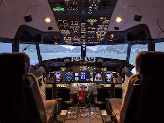

# Dan Villa
> Software Engineer

Note:
* Introduce yourself
* What does a software engineer do?

+++

# Demo

[HIS Ministry Coop](http://hisministrycoop.org)

Note:
```
div#headerLogoGreen {
    background-image:url("https://cataas.com/cat/funny?width=300&height=300");
    height: 300px;
    width: 300px;
}
```

+++


Note:
* The two bars on the right are where math and physics mostly come into play.

+++

# Up Next

* Becoming a Software Engineer
* Being a Software Engineer
* Closing Thoughts

--- 

# Up Next

* **Becoming a Software Engineer**
* Being a Software Engineer
* Closing Thoughts

+++

### First Exposure


Note:
* I was 12 yrs old
* I didn't know I was doing programming, but I just loved creating things.

+++

### Education at a Glance

* Home-schooled, Private Schooled, Running Start
* Graduated with a 2 year Associates of Science Degree
* Pursued a BS in Computer Science and Systems
* 5 1/2 yrs, working 3 jobs and had 10K in debt

+++

### A Unlikely Finish

* Graduated and proceed to... ✈️ ¡Mexico! 🇲🇽
* Connections at Boeing

Note:
* I was terrified of the idea of sitting behind a desk ALL day
* I went to Mexico to job-shadow a Missionary
* Decided that someone had to fund him and I was years away from that level of maturity
* Uncle Steven landed me a job just in time for me to ask Emily Watts out on a date

---

# Up Next

* Becoming a Software Engineer
* **Being a Software Engineer**
* Closing Thoughts

Note:
* I want to share a few projects with you to tell you what it's like doing my job.

+++

### Air Traffic Management


Note:
* Project: Provide up to date weather forecasts to optimize flight plans.
* Required some math and the basic understand of the physics of flight.

+++

### 787 Network Security


Note:
* Project: To monitor network traffic and detect anomalies.
* Based on Dendritic Cells and how they detect bad things in the body.
* We actually had a math guy that would write complex math and I would just implement it in code.

+++

@snap[north]
### Aerial Refueler
@snapend

@snap[east]

@snapend

@snap[west]

@snapend

Note:
* Project: To simulate the KC46 Boeing Aerial Refueler for pilot training and flight test verification
* I admit, I didn't actually code on this project. I was just the project manager.
* Lots of hardware and lots of math and modeling of physics required.

+++

### Airplane Health Management

```js
let cpc_1 = data & 0b1000011
if (cpc_1 && preconditions) {
  if (hi_pressure === 1) {
    let reason_code = "10"
    send_report(reason_code)
  }
}
```

Note:
* Project: To predict failures in equipment to keep planes flying more often.
* This project requires lots of working with Binary.
* Does anyone know what Binary is?
* Does anyone know why Binary runs everything?

---

# Up Next

* Becoming a Software Engineer
* Being a Software Engineer
* **Closing Thoughts**

+++

# Software is Everywhere

* Aviation, Biology, Robotics 🤖
* Diverse backgrounds in other sciences like Math and Physics are great 🔥

+++

# There's no One Way

* College
* Bootcamps
* Self Taught

Note:
* If you want to get into this field
* You can learn to code now.
* You can always ask me questions.

+++

# Thank You 

Note:
* Questions?